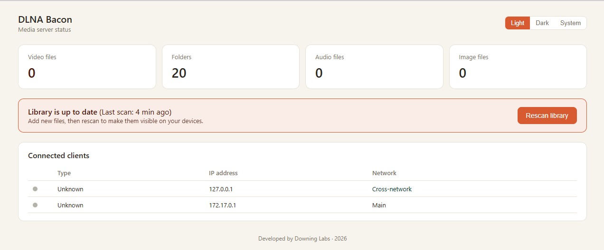
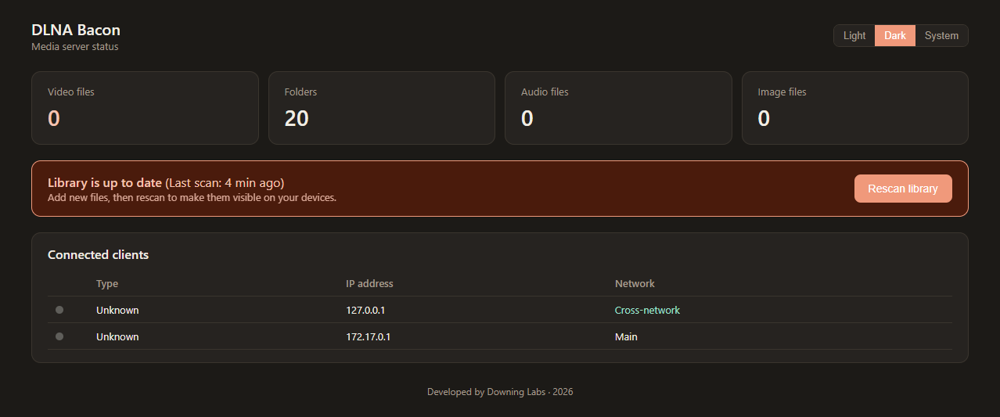

# DLNA Bacon

A fork of [ReadyMedia (formerly MiniDLNA)](https://sourceforge.net/projects/minidlna/) — a lightweight DLNA/UPnP-AV media server — with two additions:

1. **Rescan without restart.** Stock minidlna can only rescan its media library at startup; picking up newly-added files otherwise means stopping and starting the whole server. This fork adds a signal-driven rescan (`SIGUSR2` / `minidlnad -U`) that the running daemon can act on live, with no interruption to playback or DLNA discovery.
2. **A rebuilt status page.** The stock status page is a bare, unstyled HTML table. This fork replaces it with a small dashboard: library stats, a "Rescan library" button wired to the feature above, a connected-clients table, and light/dark/system theme support.

Built for a homelab setup where new media gets added often and waiting on a container restart to see it got old fast.




## License and attribution

Like upstream, this is licensed under **GPLv2**. Original code and copyright: Justin Maggard, with portions from MiniUPnPd (Thomas Bernard). This fork's additions (`webui.c`/`webui.h`, the rescan patch, Docker packaging) are released under the same license. See `COPYING`.

This is an independent fork, not affiliated with or endorsed by the ReadyMedia/MiniDLNA project.

## Quick start

```yaml
services:
  minidlna:
    image: dlna-bacon   # built locally -- see "Building" below
    container_name: minidlna
    network_mode: host
    environment:
      - MINIDLNA_MEDIA_DIR=V,/media
      - MINIDLNA_FRIENDLY_NAME=STREAMY
      - MINIDLNA_PORT=8200
      - MINIDLNA_INOTIFY=yes
      - MINIDLNA_ROOT_CONTAINER=B
      - MINIDLNA_NETWORK_INTERFACE=eth0
    volumes:
      - /path/to/media:/media:ro
      - ./cache:/minidlna/cache
    restart: unless-stopped
```

Visit `http://<host-ip>:8200/status` (use an IP, not `localhost` -- see [Notes](#notes) below). Click **Rescan library** any time you add new files.

## Building

```
git clone https://github.com/downing-labs/dlna-bacon.git
cd dlna-bacon
docker build -t dlna-bacon .
```

No `configure`/`Makefile.in`/etc. are committed to this repo -- the Dockerfile runs `autogen.sh`/`configure`/`make` fresh as part of the build. If you build outside Docker, make sure your working copy has **LF line endings**; a CRLF-contaminated `configure.ac` will produce a confusing `config.status: error: cannot find input file` error that has nothing to do with the actual missing file (this bit us during development -- see `.gitattributes`, which prevents it on a fresh clone).

## Environment variables

Same convention as [vladgh/minidlna](https://github.com/vladgh/minidlna), so an existing compose file should work with just the `image:` line swapped.

| Variable | Default | Description |
|---|---|---|
| `PUID` / `PGID` | `1000` / `1000` | UID/GID the daemon runs as; matched to your media/cache mount ownership |
| `TZ` | unset | Timezone, e.g. `America/Denver` |
| `MINIDLNA_PORT` | `8200` | HTTP/DLNA port |
| `MINIDLNA_FRIENDLY_NAME` | unset | Name shown to DLNA clients |
| `MINIDLNA_NOTIFY_INTERVAL` | unset | Seconds between SSDP announces |
| `MINIDLNA_INOTIFY` | `yes` | Live filesystem watching (`yes`/`no`) |
| `MINIDLNA_NETWORK_INTERFACE` | unset (all interfaces) | Bind to a specific interface, e.g. `eth0` |
| `MINIDLNA_ROOT_CONTAINER` | unset | Restrict the DLNA root container (e.g. `B` for Browse Directory) |
| `MINIDLNA_MEDIA_DIR`, `MINIDLNA_MEDIA_DIR_1`, `MINIDLNA_MEDIA_DIR_N`, ... | -- | One or more media directories. Bare path, or `TYPE,path` (`A`/`V`/`P`) to restrict by type |

## How the rescan feature works

- `/rescan` (GET) sets an internal flag directly in the running process -- no signal, no restart. The main loop picks it up on its next tick and runs a non-destructive rescan (same underlying mechanism as `-r`, just triggered live).
- `minidlnad -U` does the same thing from *outside* the process, via `SIGUSR2` to the running PID -- useful for scripting a rescan from, say, a upload hook on your storage server.
- Both coexist safely with `inotify` file watching; a `MONITOR_MASK` flag prevents the two from racing each other.

## Architecture note (for future upstream rebases)

The status page and rescan logic live entirely in `webui.c`/`webui.h`, new files not present upstream. The only changes to upstream's `upnphttp.c` are:
1. `#include "webui.h"`
2. `SendResp_presentation()`'s body replaced with a single call to `webui_send_status()`
3. One new `else if` in the URL routing chain for `/rescan`

The rescan-without-restart mechanism itself touches `minidlna.c`, `monitor_inotify.c`, `process.c`, and `upnpglobalvars.c`/`.h` -- see those files' diffs against upstream for the specific hunks if rebasing onto a newer release. As of this writing, upstream releases roughly once a year and the touched functions haven't changed significantly in several releases.

Gettext/`po/` translation support and the `AM_ICONV` macro were intentionally removed from the build (see comments in `configure.ac`) -- a long-standing upstream autotools/gettext interaction bug breaks `po/Makefile.in.in` regeneration when building from a raw git checkout with modern gettext, and translated UI strings aren't a goal for this fork.

## Notes

- The built-in DNS-rebinding protection requires the HTTP `Host:` header to be a literal IP address. Browsing to `http://localhost:8200/` will get you a `400 Bad Request` -- use the server's actual IP instead.
- `network_mode: host` is required for DLNA/SSDP discovery to work correctly from other devices on your network; bridge networking breaks multicast-based client discovery.

---
Developed by Downing Labs, 2026.
